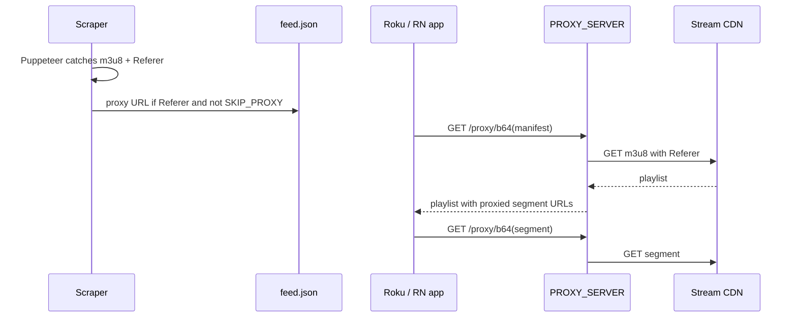

# HLS proxy and feed URLs

This document explains why some streams in `feed.json` go through a local proxy, how that is decided, and how to run or bypass the proxy servers in `proxy/`.

## The problem

Many Streamed.pk embed players load HLS (`.m3u8`) with a **`Referer`** header (often tied to `embedsports.top`). Roku and mobile players request the manifest URL directly; they do not send the same headers a browser would.

If the CDN rejects requests without that referer, playback fails when the feed points at the raw `.m3u8` URL.

## The solution

A small **LAN HTTP proxy** sits between your clients and the CDN:

1. The client requests `http://<proxy-host>:8787/proxy/<base64-of-real-url>`.
2. The proxy fetches the real manifest or segment with `Referer: https://embedsports.top/` (hardcoded in both proxy apps).
3. For manifests, the proxy rewrites the playlist so segments and encryption keys also point back through `/proxy/...`.

Clients only talk to your proxy; the proxy talks to the stream host.

## When the feed uses a proxy URL vs a direct URL

**Only** `createFeedItem()` in `src/feed-generator.js` decides this when building `feed.json`.

| Condition | URL written to feed |
|-----------|---------------------|
| `SKIP_PROXY=true` in `.env` | Always the **direct** scraped URL |
| Stream has `directFetchOk` (TimStreams / Node replay 200) | **Direct** CDN `.m3u8` (client fetches segments; proxy host is often 403’d by TikTok) |
| Stream has `headers.Referer` and not `directFetchOk` | `http://<proxy>/proxy/<base64(original m3u8)>` |
| No `headers.Referer` | **Direct** URL |

### By source

| Source | Typical `streamLinks` | Usually proxied? |
|--------|----------------------|------------------|
| **Streamed.pk** (live + 24/7) | Puppeteer adds `headers: { Referer }` from the embed | Yes, unless `SKIP_PROXY=true` or `directFetchOk` |
| **TimStreams** (timst.top / grandemx) | Signed junksonus `.m3u8` + `directFetchOk` | No — raw HTTPS URL (like VLC / livepush) |
| **onhockey.tv** | `{ provider, url }` only — no `headers` | No — always direct |

If Puppeteer does not capture a referer, the stream stays direct even from Streamed.pk.

`streamSignature` in the feed always uses the **original** URL (before any proxy rewrite), so diffing games is unaffected.

### Example URLs in `feed.json`

**Proxied:**

```text
http://192.168.1.50:8787/proxy/aHR0cHM6Ly8uLi4ubTN1OA==
```

**Direct:**

```text
https://cdn.example.com/path/playlist.m3u8
```

During a scraper run, proxied streams log:

```text
-- Found referer for stream. Rewriting URL for hardcoded proxy: https://...
```

## Environment variables

| Variable | Default | Purpose |
|----------|---------|---------|
| `SKIP_PROXY` | unset (`false`) | Set to `true` to write **direct** CDN URLs only (no proxy host in the feed). Use when the proxy server is down or you want to test raw playback. |
| `PROXY_SERVER` | `http://192.168.1.50:8787` | Base URL embedded in the feed when proxying. Must match where you run the proxy and what clients can reach on your LAN. |

Add to `.env`:

```env
SKIP_PROXY=true
# PROXY_SERVER=http://192.168.1.50:8787
```

**Note:** Skipping the proxy does not add referer headers on the client. Many Streamed.pk streams may still fail without the proxy; onhockey / some direct URLs may work anyway.

## The two proxy implementations

Both live under `proxy/`. Run **one** of them on port **8787** (or change `PROXY_SERVER` and the `proxyHost` constant inside the file you use so manifest rewrites match).

The scraper does **not** choose between them — only the URL shape matters: `GET /proxy/<base64-encoded-upstream-url>`.

### `proxy/index.js` (warren-bank HLS proxy)

- **Stack:** CommonJS, Express, `@warren-bank/hls-proxy`
- **Mount:** `app.use('/proxy', middleware.request)`
- **Behavior:** Library fetches upstream with fixed headers and rewrites playlists
- **Referer:** `https://embedsports.top/`
- **Rewrite host:** `proxyHost` in file (default `192.168.1.50:8787`)

### `proxy/advanced-proxy.js` (custom, recommended)

- **Stack:** ESM, Express, **Puppeteer** (`proxy/browser-fetch.js`)
- **Route:** `GET /proxy/:b64Payload` where payload is JSON `{ u, r, h?, e? }`
- **Behavior:** Opens the embed page (`e`) in Chromium and keeps it warm. Manifests are captured from the live player (or via navigation). Segments try direct HTTP first, then **in-page `fetch()` on the embed tab** (correct Origin/cookies), then CDP `Network.loadNetworkResource` — never `page.goto(.ts)` (that aborts with `net::ERR_ABORTED` on strmd). Rewrites `#EXT-X-KEY` and segment lines to proxied URLs.
- **Referer / headers:** Per-stream from feed payload (`r`, `h`)
- **Embed page:** `e` in payload (re-scrape feed after this field was added)
- **CORS:** Sets `Access-Control-Allow-Origin: *`
- **Env:** `PROXY_HOST` (segment rewrite host), `PROXY_DEBUG`, `PROXY_BROWSER_IDLE_MS` (default 10 min)

Historically the feed could pass referer in the query string; that was removed. Both proxies use a **fixed** embedsports referer. The scraper still records per-stream `Referer` only to decide **whether** to proxy, not to configure the proxy per stream.

## End-to-end flow (proxied stream)



## Running the proxy

### Docker (recommended on a server)

The advanced proxy needs Chromium (Puppeteer). Build from the **repo root** so `src/` is available:

```bash
# From repo root — uses proxy/docker-compose.yml
docker compose -f proxy/docker-compose.yml up -d --build
```

Required env (set in shell, a `.env` next to the compose file, or your orchestrator):

```env
PROXY_HOST=192.168.1.50:8787
PROXY_PORT=8787
PROXY_HEADLESS=true
```

- Publish `8787` (or set `PROXY_PORT` if that host port is taken).
- `PROXY_HOST` must be the LAN IP:port clients use (same as scraper’s `PROXY_SERVER` without `http://`).
- Container gets `shm_size: 1gb` so Chromium does not crash.

Health check:

```bash
curl http://192.168.1.50:8787/
# expect: Proxy server is running (embed-first stream resolve)
```

Logs:

```bash
docker compose -f proxy/docker-compose.yml logs -f
```

### Without Docker

1. Install dependencies in `proxy/`.
2. Set `PROXY_HEADLESS=true` and `PROXY_HOST=192.168.1.50:8787` in the repo `.env`.
3. Start:

   ```bash
   cd proxy
   npm start
   # → node --env-file=../.env advanced-proxy.js
   ```

4. Ensure `PROXY_SERVER` in the scraper `.env` matches a host/IP your **Roku and phone** can reach (not `localhost` on the TV).
5. Regenerate the feed with `SKIP_PROXY` unset or `false`.

## Testing without the proxy

1. Set `SKIP_PROXY=true` in `.env`.
2. Run `npm start` (or `DRY_RUN=true` for local-only).
3. Confirm `dist/feed.json` video URLs are `https://...` with no `8787/proxy` path.

For a quick proxy URL preview from a single embed, see `src/test-stream.js`.

## Related files

| File | Role |
|------|------|
| `src/feed-generator.js` | Proxy rewrite + `SKIP_PROXY` / `PROXY_SERVER` |
| `src/streamed-scraper.js` | Sets `headers.Referer` on Streamed.pk streams |
| `src/scraper.js` | onhockey streams (usually no referer → direct) |
| `proxy/index.js` | HLS proxy (library) |
| `proxy/advanced-proxy.js` | HLS proxy (custom, embed-first) |
| `proxy/Dockerfile` | Docker image for advanced proxy |
| `proxy/docker-compose.yml` | Compose service (`roku-hls-proxy`) |
| `docs/LOCAL_SETUP.md` | General local setup |
